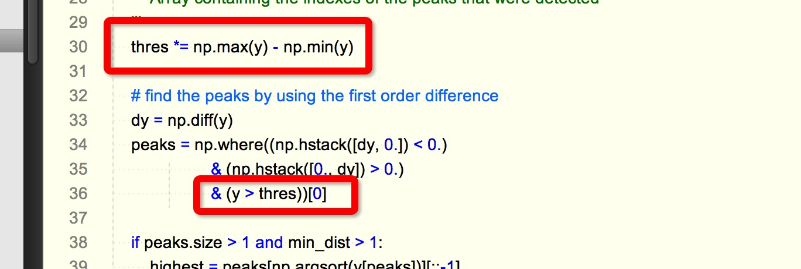
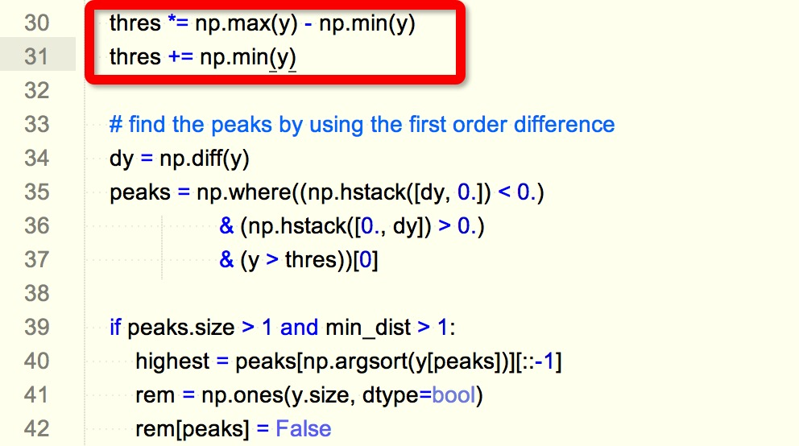
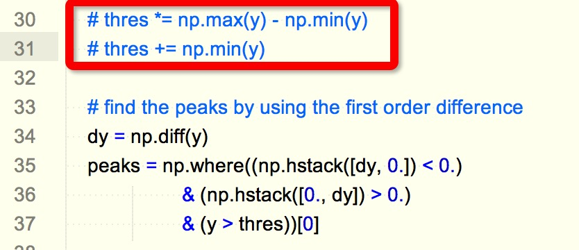

#### peakutils

源代码: [https://bitbucket.org/lucashnegri/peakutils](https://bitbucket.org/lucashnegri/peakutils)     
Python包: [https://pypi.python.org/pypi/PeakUtils](https://pypi.python.org/pypi/PeakUtils)    
使用方法: [http://pythonhosted.org/PeakUtils/tutorial_a.html](http://pythonhosted.org/PeakUtils/tutorial_a.html)   

#### 说明
本来用"sudo pip install peakutils"安装好就可以使用的    
但是，其源代码上有一个重大bug，以致其基本不可使用      
问题如下: 

   

更改后的如下:   

   

还可以更改为如下: 

   

将阈值的控制放在外面，比如当要取比平均值更大时，更加好用:    

thres = np.mean(y)